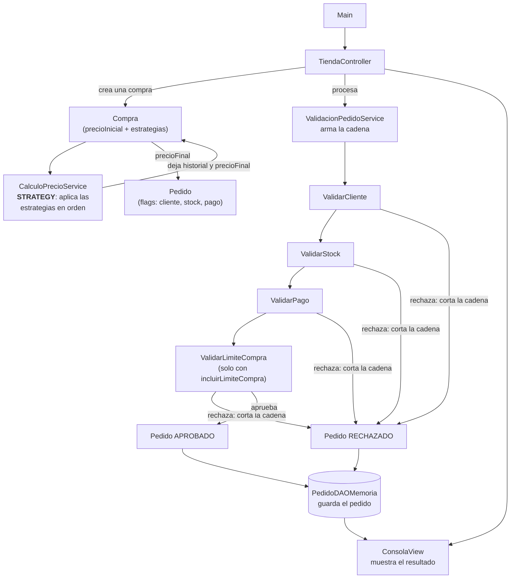

# TP Patrones de Diseno - Strategy + Chain of Responsibility

Tienda online que calcula el precio final de una compra (**Strategy**) y luego
valida el pedido resultante a traves de una cadena de controles (**Chain of
Responsibility**), organizado con la arquitectura Model (domain + services +
dao) - Vista - Controlador.

## Estructura del proyecto

```
src/main/java/com/tienda/
  Main.java                                # Presenta el proyecto (demo en TestRunner)
  model/
    utils/PrecioUtil.java                  # formatearPrecio (compartido)
    domain/                                # Entidades y contratos
      Compra.java                          # Compra (guarda sus estrategias)
      Pedido.java                          # Pedido (guarda el historial de pasos)
      EstrategiaDescuento.java             # Interfaz Strategy
      Handler.java                         # Clase abstracta Chain of Responsibility
      ResultadoValidacion.java             # Resultado de una validacion
    services/                              # Reglas de negocio
      ClienteComun.java                    # Cliente sin descuento
      ClientePremium.java                  # -10%
      ClienteVip.java                      # -15%
      DescuentoPorCantidad.java            # -5% (>5) / -10% (>10)
      EnvioRetiroSucursal.java             # +$0
      EnvioNormal.java                     # +$5.000
      EnvioExpress.java                    # +$10.000
      PromocionPorcentual.java             # Promocion parametrizable
      DescuentoBlackFriday.java            # DESAFIO (-25%)
      CalculoPrecioService.java            # Ejecuta el Strategy sobre una Compra
      ValidarCliente.java                  # Control de cliente
      ValidarStock.java                    # Control de stock
      ValidarPago.java                     # Control de pago
      ValidarLimiteCompra.java             # DESAFIO (limite $500.000)
      ValidacionPedidoService.java         # Arma y ejecuta la cadena
    dao/
      PedidoDAO.java                       # Interfaz de persistencia
      PedidoDAOMemoria.java                # Implementacion en memoria
  view/
    ConsolaView.java                       # Toda la salida por consola
  controller/
    TiendaController.java                  # Orquesta Model y Vista
src/test/java/com/tienda/
  TestRunner.java                          # Demo + tests (sin JUnit)
```

**Model** = `domain` + `services` + `dao`:

- `domain` tiene las entidades (`Compra`, `Pedido`) y los **contratos** de los
  dos patrones (`EstrategiaDescuento`, `Handler`), sin ninguna regla de negocio
  concreta.
- `services` tiene el **comportamiento del sistema**: las implementaciones
  concretas de Strategy (reglas de descuento/recargo) y de Chain of
  Responsibility (validadores), mas los dos servicios que las ejecutan.
- `dao` persiste los `Pedido` ya procesados.

**Vista** (`view/ConsolaView.java`) es la unica capa que hace `print`.
**Controlador** (`controller/TiendaController.java`) conecta Vista y Model, sin
reglas de negocio propias.

## Como correr la demo y los tests

```bat
compile.bat   # compila main + TestRunner (sin dependencias)
run.bat       # compila y muestra Main (presentacion)
test.bat      # compila y corre TestRunner (15 PASS, con la demo)
```

Manual sin scripts:

```bat
javac -d out -encoding UTF-8 -sourcepath src\main\java src\main\java\com\tienda\Main.java
javac -d out -encoding UTF-8 -cp out -sourcepath src\test\java src\test\java\com\tienda\TestRunner.java
java -cp out com.tienda.TestRunner
```

`TestRunner` muestra la demo completa (PARTE 1, PARTE 2, DESAFIO y DAO) y
despues corre las verificaciones unitarias de los tres servicios.

## Diagrama de funcionamiento



Diagrama de clases en `docs/diagrama.puml` (PlantUML).

`Compra` acumula un `precio_final` combinando las `EstrategiaDescuento` que se
le agregaron (Strategy), a traves de `CalculoPrecioService`. Ese precio pasa a
formar parte de un `Pedido`, que `ValidacionPedidoService` hace recorrer la
cadena de `Handler` (Chain of Responsibility) para ser aprobado o rechazado.
Los dos patrones son independientes entre si; se comunican unicamente a traves
del dato `precio_final`, y `TiendaController` es el unico que conoce a ambos
servicios.

## Preguntas

**?Que problema resuelve Strategy?** Evita tener un unico metodo gigante con
`if` para cada combinacion posible de cliente, cantidad, envio y promocion.
Cada regla de precio queda encapsulada en su propia clase de `services`,
intercambiable en tiempo de ejecucion, y se pueden agregar reglas nuevas (por
ejemplo `DescuentoBlackFriday`) sin tocar el codigo que ya funciona (principio
abierto/cerrado).

**?Por que una compra puede necesitar varias estrategias?** Porque las reglas
del negocio no son excluyentes: el mismo pedido puede tener a la vez un tipo
de cliente, un descuento por cantidad, una promocion especial y un costo de
envio. `Compra` no aplica "una" estrategia sino una lista de estrategias, que
`CalculoPrecioService` aplica en secuencia sobre el precio acumulado; por eso
el orden de agregado importa (los descuentos porcentuales se calculan siempre
sobre el precio ya afectado por las reglas anteriores).

**?Que problema resuelve Chain of Responsibility?** Evita que un unico
metodo/objeto conozca y ejecute todas las validaciones del pedido (cliente,
stock, pago, limite de compra). Cada control es un `Handler` de `services` que
solo sabe validar una cosa y pasar el pedido al siguiente. Se pueden agregar,
quitar o reordenar controles (como `ValidarLimiteCompra`) sin modificar los
demas.

**?Que sucede cuando un elemento de la cadena rechaza el pedido?** El `Handler`
que detecta el problema llama a `pedido.rechazar(...)`, guarda el motivo y
devuelve `false` sin invocar al siguiente elemento de la cadena: el
procesamiento se detiene ahi mismo y ninguna validacion posterior se ejecuta
(ver `PED-002`, que falla en `ValidarStock` y nunca llega a `ValidarPago`).

## Decisiones de arquitectura (Model / Vista / Controlador)

**?Por que los contratos (`EstrategiaDescuento`, `Handler`) estan en `domain`
y las implementaciones concretas en `services`?** Porque `domain` modela los
conceptos del problema (que es una `Compra`, que es un `Pedido`, que una
compra "puede tener reglas de precio") sin conocer ningun numero de negocio.
Los porcentajes, montos y condiciones concretas (15% VIP, +$10.000 de envio
Express, el limite de $500.000) son el comportamiento del sistema, que es la
responsabilidad que le corresponde a `services`. Separarlos asi permite
cambiar una regla de negocio sin tocar la estructura del modelo, y viceversa.

**?Por que se agrego una capa DAO si el TP no pide persistencia?** Porque
contemplar todos los aspectos del proyecto (diseno, arquitectura,
implementacion, pruebas, mantenimiento) implica dejar el "enchufe" de
persistencia listo desde el diseno. Se definio como una interfaz (`PedidoDAO`)
con una implementacion en memoria (`PedidoDAOMemoria`): el dia que el sistema
necesite guardar los pedidos en una base de datos real, alcanza con escribir
una nueva clase que implemente `PedidoDAO`, sin tocar `services`, `controller`
ni `view`.

**?Por que `Compra` no tiene su propio DAO?** Porque `Compra` es un objeto de
calculo transitorio: existe solo para reunir los datos que necesita
`CalculoPrecioService` y producir un `precio_final`, que es lo que
efectivamente viaja hacia el `Pedido` y se persiste. No hay ningun caso de uso
que necesite volver a consultar una `Compra` mas adelante, asi que agregarle
un DAO propio seria persistencia sin justificacion.

**?Por que toda la impresion por consola vive en `ConsolaView` y no en los
`services` o en `Handler`?** Porque asi el Controlador y los Services no
dependen de "como" se le muestra algo al usuario: solo calculan datos y los
dejan disponibles (`compra.getHistorial()`, `pedido.getPasos()`). Si manana
este sistema necesitara una interfaz web en lugar de la consola, alcanza con
escribir otra vista que consuma los mismos `services` sin modificarlos.

## Desafio (Open/Closed)

- `DescuentoBlackFriday` se agrego como una clase nueva en `services` que
  implementa `EstrategiaDescuento`; ninguna estrategia existente se modifico.
- `ValidarLimiteCompra` se agrego como una clase nueva en `services` que
  extiende `Handler`; `ValidarCliente`, `ValidarStock` y `ValidarPago`
  quedaron intactos. `ValidacionPedidoService(true)` simplemente lo enchufa al
  final de la cadena existente.

## Requisitos

- Java 8+ (probado con Temurin 1.8)
- No necesita Maven ni ninguna dependencia